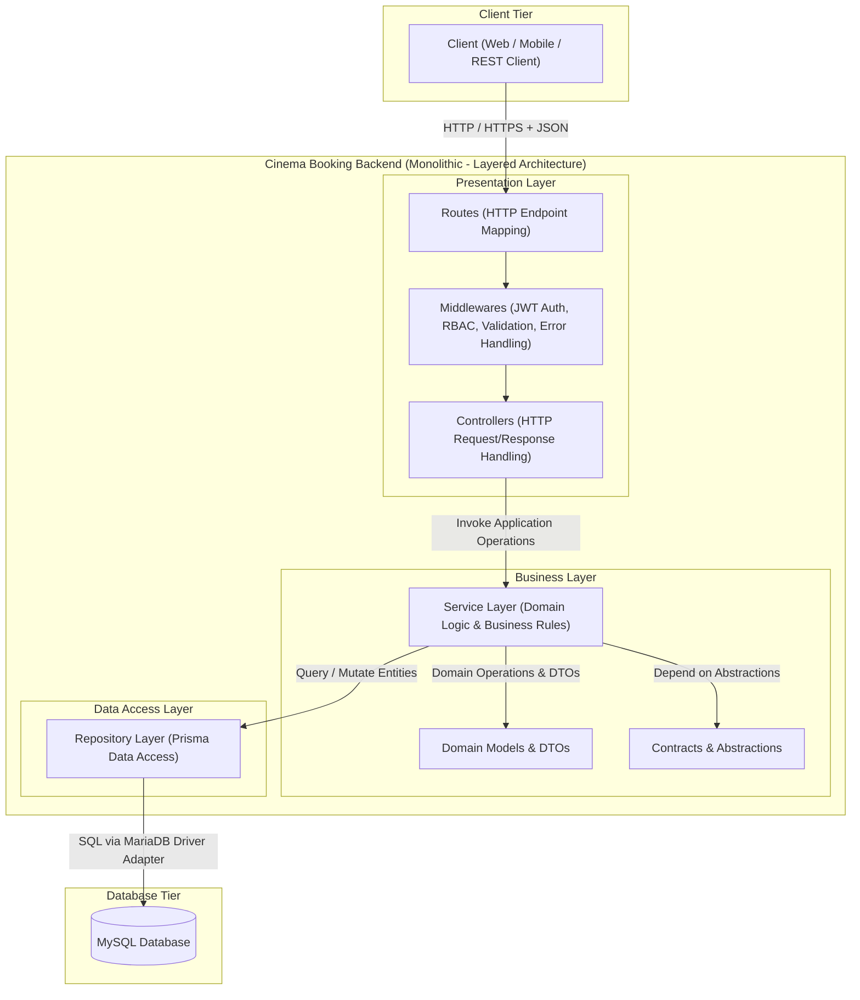
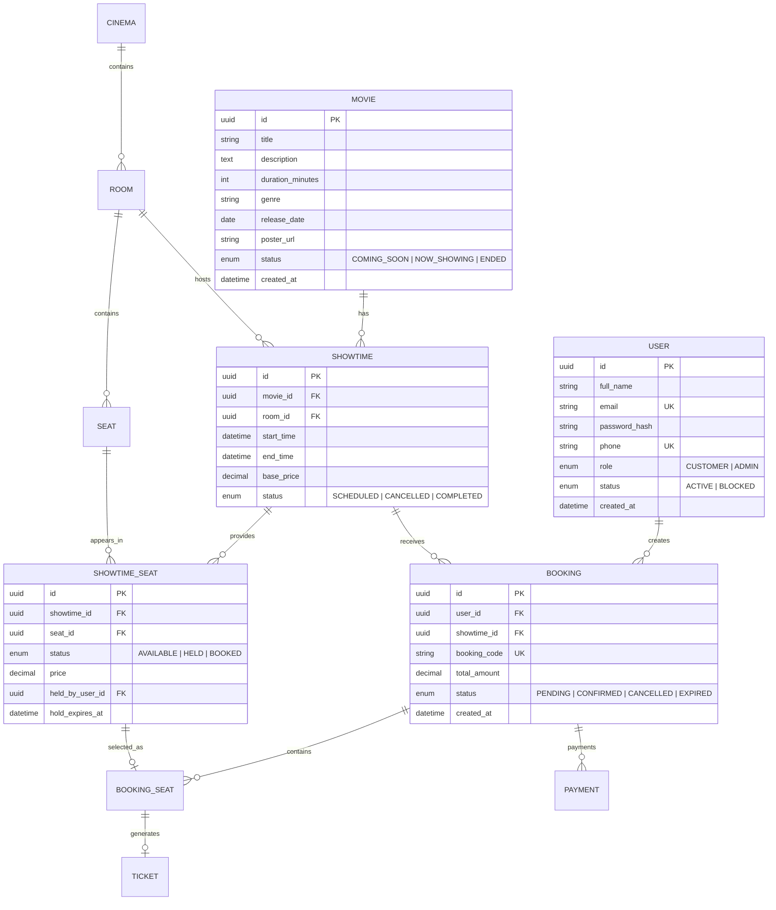

# 🎬 Cinema Booking System (CBS) - Software Architecture Specification

Tài liệu đặc tả kiến trúc phần mềm và cấu trúc hệ thống của dự án **Cinema Booking System (CBS)**, được xây dựng và chuẩn hóa dựa trên tài liệu đặc tả chính thức **Software Requirements Specification (SRS) & Software Architecture Design (Phase 1 – Basic Functional Backend)**.

---

## 📌 1. Giới thiệu tổng quan & Phạm vi (Introduction & Scope)

### 1.1. Mục đích hệ thống (Purpose)
Cinema Booking System là hệ thống phần mềm backend cung cấp dịch vụ web RESTful API cho phép:
- Khách hàng (**Customer**): Tìm kiếm phim, tra cứu lịch chiếu, kiểm tra tình trạng ghế theo thời gian thực và thực hiện đặt vé xem phim trực tuyến.
- Quản trị viên (**Admin**): Quản lý dữ liệu danh mục phim, rạp chiếu, phòng chiếu, sơ đồ ghế và lịch chiếu.

Hệ thống được thiết kế theo các nguyên lý kiến trúc phần mềm sạch (**Clean/Layered Architecture**), phân tách rõ ràng trách nhiệm giữa các tầng (Separation of Concerns), đảm bảo tính toàn vẹn dữ liệu (Data Integrity) và sẵn sàng mở rộng cho các giai đoạn tiếp theo.

### 1.2. Phạm vi giai đoạn 1 (Scope: Phase 1 – Basic Functional Backend)
Hệ thống tập trung triển khai đầy đủ các nhóm chức năng cốt lõi:
1. **Quản lý tài khoản & Xác thực:** Đăng ký, đăng nhập và bảo vệ tài nguyên qua JSON Web Token (JWT).
2. **Khám phá phim (Movie Browsing):** Xem danh sách phim và thông tin chi tiết phim.
3. **Tra cứu suất chiếu (Showtime Browsing):** Xem danh sách suất chiếu theo phim, phòng chiếu và rạp.
4. **Kiểm tra tình trạng ghế (Seat Availability):** Tra cứu ghế trống/đã đặt theo ngữ cảnh của từng suất chiếu cụ thể.
5. **Đặt vé (Booking Management):** Đặt vé, xem lịch sử đặt vé và hủy vé.
6. **Quản trị hệ thống (Administration):** Quản lý CRUD cơ bản đối với Phim, Rạp, Phòng, Ghế và Suất chiếu.

### 1.3. Ranh giới phạm vi (Scope Boundaries)
Trong Phase 1, hệ thống **không** bao gồm:
- Xử lý thanh toán tiền thật (Payment Gateway, thẻ tín dụng/ví điện tử).
- Hoàn tiền (Refund), hệ thống gợi ý phim (Recommendation), đánh giá/bình luận (Rating/Review).
- Cơ chế giữ ghế có thời hạn (Seat hold timeout), danh sách chờ (Waiting list), giá vé động (Dynamic pricing).
- Hạ tầng phân tán phức tạp: Microservices, Message Queue, Kubernetes hoặc Caching phân tán.

---

## 🏛️ 2. Thiết kế kiến trúc phần mềm (Architectural Design)

Kiến trúc của Cinema Booking System được quyết định bởi 3 phong cách kiến trúc phối hợp:



### 2.1. Phong cách kiến trúc Monolithic (Monolithic Architecture)
- Toàn bộ các module nghiệp vụ (Auth, Movie, Cinema, Room, Seat, Showtime, Booking) được đóng gói và vận hành trong **một ứng dụng backend duy nhất**, dùng chung một cơ sở dữ liệu MySQL.
- Các Service không phải là các microservice độc lập mà là các thành phần logic nội bộ, giúp tối ưu chi phí vận hành, loại bỏ overhead của hệ thống phân tán và đơn giản hóa quá trình phát triển, kiểm thử.

### 2.2. Kiến trúc Client–Server (Client–Server Architecture)
- Client và Backend hoàn toàn độc lập và giao tiếp độc quyền thông qua giao thức **HTTP/HTTPS** với định dạng trao đổi dữ liệu chuẩn **JSON**.
- Client tuyệt đối không được truy cập trực tiếp vào cơ sở dữ liệu.

### 2.3. Kiến trúc phân tầng 3 lớp (3-Tier Layered Architecture)
Mã nguồn backend được phân tách thành 3 tầng riêng biệt với trách nhiệm rõ ràng:

1. **Presentation Layer (`src/api`):**
   - **Routes:** Tiếp nhận URL, ánh xạ HTTP Method (GET, POST, PUT, DELETE) tới Controller phù hợp.
   - **Controllers:** Chịu trách nhiệm bóc tách request (params, query, body), gọi tầng Service tương ứng và chuyển kết quả thành HTTP Response chuẩn. **Controller không chứa logic nghiệp vụ chính.**
   - **Middlewares:** Đảm nhiệm các mối quan tâm xuyên suốt (Cross-cutting Concerns):
     - `Authentication Middleware`: Xác thực JWT Token từ header `Authorization: Bearer <token>`.
     - `Authorization Middleware`: Kiểm tra quyền hạn vai trò (Role-Based Access Control: `CUSTOMER` vs `ADMIN`).
     - `Validation Middleware`: Kiểm thực tính hợp lệ của dữ liệu đầu vào sử dụng Zod schema trước khi đưa vào Service.
     - `Error Handling Middleware`: Bắt và chuẩn hóa toàn bộ lỗi thành định dạng response thống nhất `{ success: false, message, errors }`.

2. **Business Layer (`src/business`):**
   - Là "trái tim" của hệ thống, chứa toàn bộ quy tắc nghiệp vụ, kiểm tra ràng buộc và tính toán logic.
   - **Các Candidate Services:**
     - `AuthenticationService`: Đăng ký, đăng nhập, mã hóa mật khẩu, tạo token JWT.
     - `MovieService`: Duyệt danh sách phim, xem chi tiết, CRUD phim cho Admin.
     - `CinemaService`: Quản lý danh mục rạp chiếu phim.
     - `RoomService`: Quản lý phòng chiếu theo từng rạp.
     - `SeatService`: Quản lý sơ đồ ghế vật lý theo phòng chiếu.
     - `ShowtimeService`: Quản lý lịch chiếu phim theo phòng và khung giờ.
     - `BookingService`: Xử lý tạo đặt vé, kiểm tra chống trùng ghế, xem và hủy vé.
   - **Nguyên tắc:** Service hoàn toàn độc lập với giao thức HTTP (không phụ thuộc vào `req`, `res`), giúp dễ dàng viết unit test.

3. **Data Access Layer (`src/data-access`):**
   - Ứng dụng **Repository Pattern** để cô lập tầng nghiệp vụ khỏi chi tiết triển khai cơ sở dữ liệu.
   - Các Repository (`UserRepository`, `MovieRepository`...) nhận trách nhiệm thực hiện các truy vấn dữ liệu thông qua Prisma ORM 7.
   - Service không viết câu lệnh SQL/Prisma trực tiếp mà tương tác thông qua interface của Repository.

4. **Database Layer:**
   - Hệ quản trị cơ sở dữ liệu quan hệ **MySQL 8.4**, đảm bảo tính toàn vẹn dữ liệu quan hệ (ACID) thông qua Foreign Keys, Unique Constraints và Transactions.

### 2.4. Quy tắc phụ thuộc (Dependency Rule)
- Hướng phụ thuộc tuân thủ nghiêm ngặt **một chiều từ trên xuống dưới**:
  $$\text{Presentation Layer} \longrightarrow \text{Business Layer} \longrightarrow \text{Data Access Layer} \longrightarrow \text{Database}$$
- **Quy tắc bất biến:**
  - Controller không được gọi trực tiếp Repository hoặc Database.
  - Service không được import hay sử dụng đối tượng HTTP của Express (`Request`, `Response`).
  - Các tầng trên không được nhảy cóc qua mặt tầng dưới.

---

## 📊 3. Mô hình miền nghiệp vụ & Cơ sở dữ liệu (Domain Model & ERD)

### 3.1. Các thực thể cốt lõi (Core Entities)
Hệ thống quản lý 11 thực thể nghiệp vụ chính:

| Thực thể | Mô tả trách nhiệm nghiệp vụ |
| :--- | :--- |
| **User** | Đại diện cho tài khoản người dùng (`CUSTOMER` hoặc `ADMIN`). |
| **Cinema** | Đại diện cho cụm rạp chiếu phim vật lý (tên rạp, địa chỉ, thành phố). |
| **Room** | Phòng chiếu thuộc một cụm rạp cụ thể, có loại phòng (`STANDARD`, `VIP`, `IMAX`, `THREE_D`) và sức chứa (`capacity`). |
| **Seat** | Ghế vật lý thuộc một phòng chiếu, xác định bởi hàng (`row_label`), số ghế (`seat_number`), loại ghế (`STANDARD`, `VIP`, `COUPLE`). |
| **Movie** | Phim chiếu tại rạp (tiêu đề, thời lượng, thể loại, ngày phát hành, poster, trạng thái). |
| **Showtime** | Suất chiếu liên kết một phim cụ thể tại một phòng chiếu cụ thể vào khung thời gian xác định (`start_time`, `end_time`). |
| **ShowtimeSeat** | **Thực thể trung gian then chốt:** Thể hiện trạng thái (`AVAILABLE`, `HELD`, `BOOKED`) và giá vé của một ghế vật lý trong một suất chiếu cụ thể. |
| **Booking** | Đơn đặt vé của khách hàng cho một suất chiếu, xác định mã đặt vé, tổng tiền, thời gian đặt và trạng thái (`PENDING`, `CONFIRMED`, `CANCELLED`, `EXPIRED`). |
| **BookingSeat** | Danh sách các ghế được chọn trong một đơn booking. |
| **Ticket** | Vé xem phim chính thức được sinh ra sau khi booking thành công, chứa mã vé (`ticket_code`) và mã QR. |
| **Payment** | Giao dịch thanh toán gắn với đơn booking (chuẩn bị cấu trúc cho giai đoạn sau). |

### 3.2. Sơ đồ quan hệ thực thể (ERD Diagram)



### 3.3. Các quy tắc nghiệp vụ cốt tử (Crucial Business Rules)
Hệ thống tuân thủ nghiêm ngặt 12 quy tắc nghiệp vụ (**BR-01** đến **BR-12**):

- **BR-01 (Unique Identity):** Mỗi tài khoản phải có định danh duy nhất (Email và Số điện thoại không được trùng lặp).
- **BR-02 & BR-03 (Authentication & Authorization):** Khách hàng phải đăng nhập trước khi thực hiện đặt vé; Các chức năng quản trị hệ thống chỉ dành riêng cho tài khoản có quyền `ADMIN`.
- **BR-04 & BR-05 (Spatial Integrity):** Một phòng chiếu bắt buộc phải thuộc về một rạp; một ghế bắt buộc phải thuộc về một phòng chiếu và không thể thuộc nhiều phòng cùng lúc.
- **BR-06 & BR-07 (Showtime Constraints):** Mỗi suất chiếu phải chiếu đúng một bộ phim và diễn ra tại đúng một phòng chiếu cụ thể.
- **BR-08 (Seat Availability Is Showtime-Specific):**
  > **Quy tắc then chốt:** Trạng thái ghế (`AVAILABLE`, `HELD`, `BOOKED`) **không bao giờ được lưu trực tiếp trên bảng `Seat` vật lý**. Trạng thái ghế bắt buộc phải gắn với ngữ cảnh của từng suất chiếu (`ShowtimeSeat`), vì cùng một ghế vật lý $A_1$ có thể đã được đặt ở Suất chiếu 1 nhưng vẫn hoàn toàn trống ở Suất chiếu 2.
- **BR-09 (No Double Booking):** Tuyệt đối không cho phép hai booking khác nhau đặt cùng một ghế trong cùng một suất chiếu (được đảm bảo bằng Unique Index và Database Transaction).
- **BR-10 (Booking Ownership):** Khách hàng chỉ có quyền tra cứu hoặc hủy đơn đặt vé do chính mình tạo ra.
- **BR-11 (Cancelled Booking Seat Release):** Khi đơn booking bị hủy hợp lệ, toàn bộ ghế liên quan phải được giải phóng về trạng thái `AVAILABLE` để các khách hàng khác có thể tiếp tục đặt.
- **BR-12 (No Real Payment):** Giai đoạn Phase 1 ghi nhận thông tin đặt chỗ mà không thực hiện trừ tiền thật qua cổng thanh toán.

---

## 📋 4. Bảng phân rã 14 Use Cases chính (Use Case Overview)

Hệ thống được thiết kế hoàn chỉnh xung quanh **14 Use Cases** phân theo 2 nhóm Actor:

### 4.1. Use Cases dành cho Khách hàng (Customer Use Cases)

| Mã Use Case | Tên Use Case | Độ ưu tiên | Service chịu trách nhiệm | Mô tả tóm tắt |
| :--- | :--- | :--- | :--- | :--- |
| **UC-01** | Register Customer | High | `AuthenticationService` | Khách hàng đăng ký tài khoản mới với thông tin hợp lệ. |
| **UC-02** | Login Customer | High | `AuthenticationService` | Khách hàng đăng nhập, nhận JWT Access Token. |
| **UC-03** | Browse Movies | High | `MovieService` | Xem danh sách các phim hiện đang có trên hệ thống. |
| **UC-04** | View Movie Details | Medium | `MovieService` | Xem chi tiết thông tin phim, thời lượng, mô tả, thể loại. |
| **UC-05** | View Showtimes | High | `ShowtimeService` | Xem lịch chiếu theo phim, rạp, phòng chiếu và thời gian. |
| **UC-06** | View Available Seats | High | `SeatService` / `ShowtimeService` | Tra cứu sơ đồ ghế và tình trạng trống/đã đặt của một suất chiếu. |
| **UC-07** | **Create Booking** | **Critical** | `BookingService` | Đặt ghế xem phim, kiểm tra xung đột và chống double booking. |
| **UC-08** | View Booking | High | `BookingService` | Khách hàng xem lịch sử và chi tiết các đơn booking của chính mình. |
| **UC-09** | Cancel Booking | Medium | `BookingService` | Khách hàng hủy vé (nếu thỏa mãn điều kiện) và giải phóng ghế. |

### 4.2. Use Cases dành cho Quản trị viên (Admin Use Cases)

| Mã Use Case | Tên Use Case | Độ ưu tiên | Service chịu trách nhiệm | Mô tả tóm tắt |
| :--- | :--- | :--- | :--- | :--- |
| **UC-10** | Manage Movies | High | `MovieService` | Thực hiện CRUD thông tin phim (Thêm, sửa, xóa phim). |
| **UC-11** | Manage Cinemas | Medium | `CinemaService` | Thực hiện CRUD cụm rạp chiếu phim. |
| **UC-12** | Manage Rooms | Medium | `RoomService` | Thực hiện CRUD phòng chiếu theo rạp. |
| **UC-13** | Manage Seats | Medium | `SeatService` | Quản lý sơ đồ ghế vật lý của từng phòng chiếu. |
| **UC-14** | Manage Showtimes | High | `ShowtimeService` | Lập lịch, tạo suất chiếu, chỉnh sửa và hủy suất chiếu. |

---

## 📂 5. Cấu trúc thư mục dự án & Phân định trách nhiệm (Project Structure)

Dự án được tổ chức theo cấu trúc module phân lớp chuẩn (được quy định tại trang 91–92 tài liệu `CBS Docs.pdf`):

```
Cinema-Booking-System/
├── src/
│   ├── api/                           # [Presentation Layer]
│   │   ├── routes/                    # Định nghĩa RESTful endpoints và mapping tới Controller
│   │   ├── controllers/               # Tiếp nhận HTTP Request, gọi Service, trả HTTP Response
│   │   ├── middlewares/               # Express middlewares: JWT Auth, RBAC, Error Handler
│   │   └── validators/                # Validation schemas sử dụng thư viện Zod
│   │
│   ├── business/                      # [Business Layer]
│   │   ├── services/                  # Business Logic Services thuần túy, độc lập với HTTP
│   │   ├── interfaces/                # Contracts, DTOs & Abstractions (Dependency Inversion)
│   │   └── models/                    # Domain Models & Pure TypeScript Enums
│   │
│   ├── data-access/                   # [Data Access Layer]
│   │   ├── repositories/              # Repository implementations thực hiện truy vấn dữ liệu
│   │   └── prisma/                    # Cấu hình Prisma Client & Database Adapters
│   │
│   ├── shared/                        # [Cross-Cutting Shared Utilities]
│   │   ├── errors/                    # Custom Application Error Classes (AppError, NotFoundError...)
│   │   ├── auth/                      # JWT generation, token verification & password hashing
│   │   └── utils/                     # Các hàm tiện ích dùng chung
│   │
│   ├── config/                        # Cấu hình OpenAPI/Swagger và môi trường
│   ├── app.ts                         # Cấu hình Express application, router setup & global middleware
│   └── server.ts                      # Entrypoint khởi động HTTP Server
│
├── prisma/
│   ├── schema.prisma                  # Prisma 7 schema định nghĩa Database Models
│   └── migrations/                    # Lịch sử các bản migration cơ sở dữ liệu
│
├── .env.example                       # File mẫu định nghĩa các biến môi trường
├── docker-compose.yml                 # Khai báo dịch vụ Docker production (App + MySQL)
├── docker-compose.override.yml        # Cấu hình phát triển local (Selective Bind Mount)
├── Dockerfile                         # Multi-stage Docker build tối ưu (Node 22 Alpine)
├── entrypoint.sh                      # Script tự động chạy migration khi container khởi động
├── package.json                       # Định nghĩa dependencies và các scripts điều khiển
└── tsconfig.json                      # Cấu hình TypeScript (NodeNext, Strict, verbatimModuleSyntax)
```

### Bảng phân định trách nhiệm từng thư mục (Folder Responsibilities)

| Thư mục | Trách nhiệm kiến trúc cụ thể |
| :--- | :--- |
| `src/api/routes/` | Khai báo đường dẫn HTTP, gắn middleware tương ứng và kết nối tới Controller. |
| `src/api/controllers/` | Tiếp nhận dữ liệu từ HTTP request, ủy quyền xử lý cho Service, chuyển đổi kết quả thành HTTP Response chuẩn. |
| `src/api/middlewares/` | Xử lý các tác vụ xuyên suốt: giải mã JWT token, kiểm tra role Admin, xử lý lỗi tập trung. |
| `src/api/validators/` | Kiểm tra tính hợp lệ về kiểu và khuôn dạng dữ liệu đầu vào (Request Body, Params, Query). |
| `src/business/services/` | Hiện thực hóa toàn bộ logic nghiệp vụ, quy tắc nghiệp vụ (Business Rules) của 14 Use Cases. |
| `src/business/interfaces/` | Định nghĩa các giao ước hợp đồng (Contracts) giúp tầng Service không phụ thuộc vào hạ tầng cụ thể. |
| `src/business/models/` | Định nghĩa các Domain Entity độc lập và Enums dạng `as const` của TypeScript. |
| `src/data-access/repositories/` | Đóng gói toàn bộ câu lệnh truy vấn dữ liệu cơ sở dữ liệu qua Prisma Client. |
| `src/shared/errors/` | Định nghĩa cấu trúc lỗi chuẩn của hệ thống giúp client nhận diện chính xác nguyên nhân lỗi. |

---

*Tài liệu được biên soạn và chuẩn hóa dựa trên tài liệu **Software Requirements Specification & Architectural Design** của dự án Cinema Booking System.*
